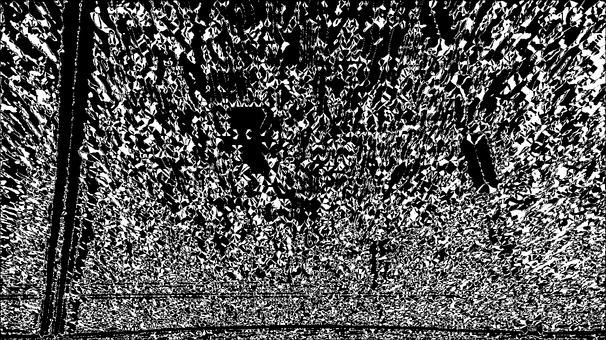
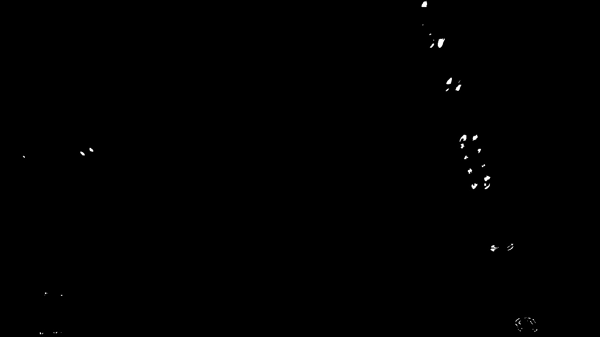
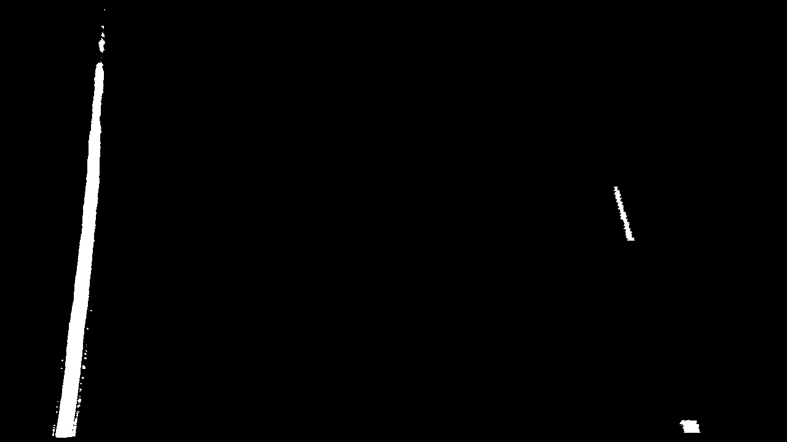

# Advanced Lane Finding Project

## Example Lane Detection Output:

[](https://www.youtube.com/watch?v=dtK_U_wv6WY)

## Goals

* Compute the camera calibration matrix and distortion coefficients given a set of chessboard images.
* Apply a distortion correction to raw images.
* Use color transforms, gradients, etc., to create a thresholded binary image.
* Apply a perspective transform to rectify binary image ("birds-eye view").
* Detect lane pixels and fit to find the lane boundary.
* Determine the curvature of the lane and vehicle position with respect to center.
* Warp the detected lane boundaries back onto the original image.
* Output visual display of the lane boundaries and numerical estimation of lane curvature and vehicle position.

## Theory of Operation

The below outlines a description of the system operation in systematic order:

### Calibration

Code: [Click Here](./src/lane_detection_pipeline/calibratecamera.py)

The raw images that are received from a camera stream do not always represent the object position in the real world. 
This is due to the fact that the camera sensor and lens cause a certain amount of distortion to the incoming light rays.
This distortion can be split into two clear areas that require correction:

**Radial Distortion**: This type of distortion manifests itself as curves at the edges and makes the images seem almost 
oval.


**Tangential Distortion**: This type of distortion is represented by a twisting of the image.


This pipeline corrects for distortion by doing the following:

1) We take a set of images recorded by the camera in question of checkerboards, the reason for this is that the black 
and white squares allow us clear definition of pixel points in the image.
2) We then proceed to find the position of the pixels where the black and white checkerboard squares meet and take these 
as our `image points` to then represent in 3D as `object points`. The more angles of the checkerboard we have, the 
better the diversity of our `image points` dataset.
 
 
 
3) Now we know our image points we can use `cv2.calibrateCamera` function, this takes in our image points along with our
object points and the image size. By using this it allows us to find the distortion centre of the image and return us 
the relevant camera matrix and our distortion coefficients.
4)Now we know both the camera matrix and the distortion coefficients we can plug these into `cv2.undistort` which allows 
us to move the pixels in our image by calculating `r` which is the amount the pixel needs to move to account for both 
our radial and tangential distortion.

An example output:

 

NOTE: The camera matrix and distortion coefficients can now be saved and applied to all of our images and videos using
this specific camera.

### Image Processing

Code: [Click Here](./src/lane_detection_pipeline/image_processing_pipeline.py)

Now we know we have a reliable image output based upon our calibration parameters we can now perform multiple steps to 
extract our lane lines.

1) The first step we do is is to apply our distortion coefficients deterined in the calibration process and undistort 
our image:


2) The next step is to perspective transform our image to a birds eye view. The reasoning behind this is if we look at 
our image strait ahead the vanishing point changes our line curvature, therefore we want to be able to see what the lane 
lines look like for the top down. To do this we:
    
    a) Define the Region of Interest (ROI) that we want too see from a birds eye perspective saving the vertex points:
    
    
    b) Define the location we want those vertex points to warp to:
    ```python
    offset = 100 #px
 
   # Four source coordinates
    src = np.float32(
        [[205, 719],  # Bottom left
         [570, 460],  # Top left
         [745, 460],  # Top right
         [1145, 719]  # Bottom right
         ])

    # Four desired coordinates
    dst = np.float32([
        [offset, img_size[1]],
        [offset, 0],
        [img_size[0] - offset, 0],
        [img_size[0] - offset, img_size[1]]
    ])
    ```
    c) We can use the `cv2.getPerspectiveTransform` to find the distortion matrix needed to get the transformation we 
    want based upon the `src` and `dst` points we have defined. This matrix can then be plugged into 
    `cv2.warpPerspective` to transform our image:
    
    
3) Now we have the required perspective we can begin to extract the lane lines. The first step is to try and make the 
lane lines as clear as possible. To do so we can convert the image to an HLS image and by splitting out the channels of 
the HLS image we can use the l_channel to find the gradients in our image as there is nice clear definition for the 
gradients and the s_channel is then good for extracting the yellow colour:


    
4) Now we have a clearly defined image we can begin to use methods to extract the lane line. The first one of these is 
to use the gradient of the image. This can be done in multiple different manors but using the base of the 
[sobel matrix](https://docs.opencv.org/3.4/d2/d2c/tutorial_sobel_derivatives.html) to take the derivative of the 
gradient over a defined kernel size. 0 will then imply a flat gradient whereas a larger number denotes a change in 
gradient or an 'edge'. This allows us to define a binary image where 1 = an edge and 0 = Not interesting 
    a) We can find a change in gradient in either the x or the y direction:
     
     
     
    
    b) We can also take the magnitude or direction of the gradinet `sqrt(sobel_x**2 + sobel_y**2)`:
    
    
    
    c) We can look at the direction of the gradient `arctan(sobel_y/sobel_x)`:
    
    
    
    d) Finally we can combine all of these gradients and take the best of each to find our lane lines in gradient:
    
    
    
5) We can now use colour to fill in were gradient was missed. To do this we use the s channel for the HLS image which 
is good for seeing the yellow lines and threshold the yellow to extract it from the image:



6) The last step of the image processing pipeline is to combine everything we have found to produce a clear output image:


### Drawing the Lane Line

Code: [Click Here](./src/lane_detection_pipeline/image_processing_pipeline.py)

Now we have a clear understanding of where our lane lines are we need to draw them to understand what they look like, 
where ego is in relation to them and how much they are curving. To do this we:

1) Take a histogram of the lower half of the image as this is where the lines will likely be more strait. This hisogram 
can show us the populated pixel count along the x-axis. From there we can perform peak finding to find where our lane 
lines are. We can also split the image in half to define the left and right lanes:


2) We can next implement a sliding windows algorithm based upon this data by:
    a) Finding either side of the peaks to define the line.
    b) Split the height of the image into *n* windows.
    c) Find the mean of the position of the non zero pixels within our defined window, we also have a parameter whereby 
    if the amount of pixels is less than the minpix then we readjust the window.
    d) Now we know the lane pixels and our search area, we can fit a polynomial based upon the highlighted lane pixels.
    
    The resulting output of this looks like this:
    

3) Whilst the sliding windows algorithim is effective for finding our lane lines it is also an expensive operation. 
However from carrying out our sliding windows algorithm we now know our polynomial coefficients of the last search, 
therefore we can now use this as an initial search area for our lane pixels:


4) Now we have two means of finding the lane line position we can also use the previous position of the lane to smooth
and average the next lane produced. This can be done by taking an average of all the x points over *n* iterations and 
then comparing the average points to the points found and smoothing them.

5) Now we have highlighted where our non zero pixels are using either method we can fit a second order polynomial to 
these areas. To do this we first use `np.polyfit` to take in the position of our non zero pixels. This produces us our
polynomial coefficients for the line. As the lines are vertical our y axis will be constant so we create a function of
x and and used our polynial coefficients to define the x position of a point for the relative y coordinate.

6) The final step is to unwarp our lane line region by taking the distorted vectors and translating these back to the 
original vectors. We can do this by using the `cv2.getPerspectiveTransform` to produce the required transformation 
matrix and then plugging this back into our warp function.


### Radius of Curvature and Ego Pose

Code (L262-L303): [Click Here](./src/lane_detection_pipeline/image_processing_pipeline.py)

With clearly defined lane lines we can now look and the shape and curve of these lines and then from this derive egos 
offset from the central position of the lane.

1) We define a function for the radius of curvature:
    
    `R_curve = ([1 + (1st derivative of x with respect to y)]**(3/2))/(|(second derivative x with respect to y)|)`
    
    We perform this function for each lane and then average between the two to find the overall curvature:
    
    `overall_curve = (left_curve + right_curve) / 2`
    
    What is important to note here is that we need to translate this measurement into respective meters from pixels. 
    To do this we make the assumption that the test images are based on US road average size and shapes. So in this case
    this image the road is 30m long and 3.7m wide so to account for this we multiply our x and y input pixels to the 
    `np.polyfit` function by the meters/pixel shape to find our m per pixel and then factor this vaue into our r_curve 
    calculation. This them means that our r_curve output value is in meters.
    
2) The final step is to understand egos pose offset from the center. For this we have a fixed camera position so we can
assume that egos position will be marked as the centre of the x axis. We now need to find the x intercept for each lane
line, again using our pixel to m values. Once we have these positions we find the centre of the lane based upon the
middle of the two x intercepts and subtract this from ego pose to find the offset.

## Discussion and Future Improvements

There are a few areas by which this lane detection pipeline could be improved:

* Firstly we can sometimes see that the change in image texture can affect how the lanes are detected. To improve this 
we can look at how we can apply different colour thresholds for edge detection and also play with different colour 
channels to better pick up edges in difficult light situations.

* We can improve the interpolation and smoothing by looking at using the polynomial coefficients and averaging these 
rather than just using the x points which is currently implemented.

* As we create a function of x and also use a second order polynomial to fit lines, we may run into issues with extreme 
curves or curves that extend past vertical. To tackle this we can look into using higher order polynomials to fit and 
shortening the search area if this extends off the vertical axis.
    


    
     